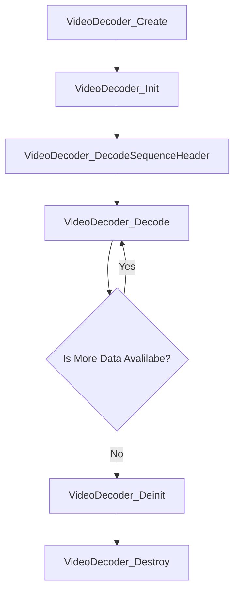
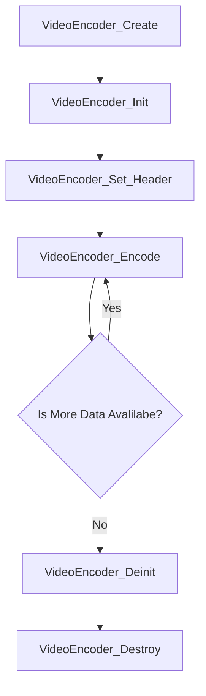

# T-Codec

# What is T-Codec?
T-Codec is a comprehensive suite of Telechips video encoding and decoding APIs, designed to work seamlessly with the Telechips VPU driver.

# APIs
## Decoding APIs
- VideoDecoder_T *VideoDecoder_Create(void);
- VideoDecoder_Error_E VideoDecoder_Destroy(VideoDecoder_T *ptVideoDecoder);
- VideoDecoder_Error_E VideoDecoder_Init(VideoDecoder_T *ptVideoDecoder, const VideoDecoder_InitConfig_T *ptConfig);
- VideoDecoder_Error_E VideoDecoder_Deinit(const VideoDecoder_T *ptVideoDecoder);
- VideoDecoder_Error_E VideoDecoder_DecodeSequenceHeader(const VideoDecoder_T *ptVideoDecoder, const VideoDecoder_SequenceHeaderInputParam_T *ptParam);
- VideoDecoder_Error_E VideoDecoder_Decode(VideoDecoder_T *ptVideoDecoder, const VideoDecoder_StreamInfo_T *ptStream, VideoDecoder_Frame_T *ptFrame);

## decoding flow

## Encoding APIs
- VideoEncoder_T *VideoEncoder_Create(void);
- VideoEncoder_Error_E VideoEncoder_Destroy(VideoEncoder_T *ptVideoEncoder);
- VideoEncoder_Error_E VideoEncoder_Init(VideoEncoder_T *ptVideoEncoder, const VideoEncoder_InitConfig_T *ptConfig);
- VideoEncoder_Error_E VideoEncoder_Deinit(const VideoEncoder_T *ptVideoEncoder);
- VideoEncoder_Error_E VideoEncoder_Set_Header(VideoEncoder_T *ptVideoEncoder, VideoEncoder_Set_Header_Result_T *ptHeader);
- VideoEncoder_Error_E VideoEncoder_Encode(VideoEncoder_T *ptVideoEncoder, VideoEncoder_Encode_Input_T *ptEncode, VideoEncoder_Encode_Result_T *ptEncodeResult);

## encoding flow
